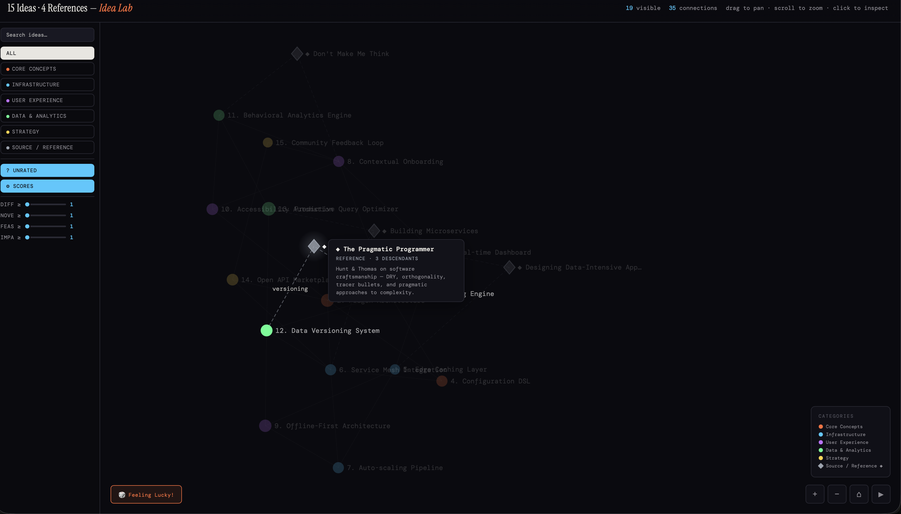

# Idea Lab

A force-directed graph for exploring and connecting ideas. No build step, no dependencies — just open `index.html`.

<br>

<p align="center">
  
</p>

<br>

## Get Started

```bash
git clone https://github.com/YOUR_USERNAME/idea-lab.git
open idea-lab/index.html
```

Edit **`data.js`** to add your own ideas. Refresh the page.

```js
// data.js — this is all you need to touch
const CATEGORIES = {
  core:      { name: 'Core Concepts', color: '#ff6b35' },
  reference: { name: 'Source',        color: '#9ca3af' },  // renders as diamonds
};

const IDEAS = [
  { id:1, cat:'core', name:'My Idea', short:'What it does.',
    difficulty:3, novelty:4, feasibility:4, impact:5, type:'Feature', connects:[201] },
];

const REFERENCES = [
  { id:201, cat:'reference', name:'Inspiration Paper', short:'Why it matters.',
    connects:[1], descendants:[1] },
];

const EDGE_LABELS = { '1-201': 'inspired by' };  // lower id first
```

## Features

| | |
|---|---|
| **Graph** | Force-directed layout with simulated annealing physics |
| **Filter** | By category, search, score sliders (difficulty/novelty/feasibility/impact) |
| **Rate** | Like/dislike per idea, filter by rating — persisted in localStorage |
| **Notes** | Per-idea notes, auto-saved to browser |
| **Inspect** | Click any node for detail panel with scores, connections, and notes |
| **Explore** | Feeling Lucky button, zoom/pan, edge labels on hover |

## License

MIT
